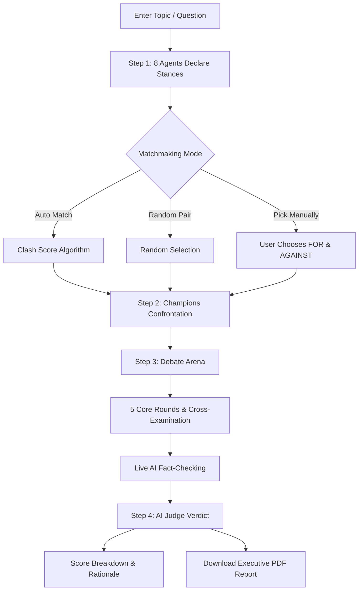

# ✦ IDEON — AI Debate Platform

**IDEON** is an autonomous multi-agent AI debate platform powered by the **Groq API**. A council of 8 diverse AI personas independently evaluate any topic, take definitive affirmative (`FOR`) or negative (`AGAINST`) stances, pair into opposing champions, clash across structured rounds with live fact-checking and cross-examinations, and receive an impartial verdict from an AI Judge — complete with a full debate report exportable to PDF.

> *"Built for conviction. Tested by contrast."*

---

## ✨ Key Features

- **8 Autonomous AI Personas**: Diverse intellectual worldviews ranging from empirical scientists and ethical philosophers to tech disruptors and contrarian satirists.
- **Strict Stances (`FOR` vs `AGAINST`)**: No vague, non-committal answers. Every agent takes a firm position regardless of the topic.
- **Anti-Echo Devil's Advocate Balancing**: On universally one-sided topics, contrarian agents automatically step up as Devil's Advocates to challenge consensus and guarantee both sides are defended.
- **3 Matchmaking Modes**:
  - **Auto Match**: Uses a clash-scoring algorithm evaluating stance opposition, expertise overlap, and personality contrast.
  - **Random Pair**: Instantly rolls two opponents into affirmative and negative slots.
  - **Pick Manually**: Gives you full control to assign any debater to `FOR` and any debater to `AGAINST`.
- **Structured Multi-Round Debate Arena**:
  - 5 core rounds + 4 cross-examination turns (14 total turns).
  - Explicit turn indicators, speaker identification, and stance border accents.
  - Recorded concessions when debaters acknowledge a valid point.
  - Live **AI Fact-Checking** with verdicts (`Supported`, `Questionable`, `Disputed`, `Opinion`, `Unverified`).
  - Reading-friendly smart auto-scroll that never interrupts your position while reviewing earlier turns.
- **Impartial AI Adjudication**:
  - Winner announced with their winning position: **`Winner: [Name] (FOR)`** or **`Winner: [Name] (AGAINST)`**.
  - 5-criterion rubric scoring: *Logic*, *Evidence*, *Rebuttal*, *Clarity*, and *Persuasion*.
  - Analysis of strongest arguments, exposed vulnerabilities, and the key turning point.
- **Executive PDF Report Export**:
  - Full chronological transcript of all speeches, cross-examinations, and verified claims.
  - One-click print/download to PDF formatted in a clean, publication-grade light theme on white paper.
- **Refined Editorial Design**:
  - Obsidian dark theme (`#0a0908`), Google Font **Inter Tight**, animated constellation grid background, subtle SVG noise grain, and tactile pill buttons.

---

## 🏛️ System Architecture

```
IDEON/
├── backend/
│   ├── .env.example              # Environment variables template
│   ├── requirements.txt          # Dependencies (FastAPI, Uvicorn, Groq, Pydantic)
│   ├── main.py                   # FastAPI application & API routes
│   ├── config.py                 # Pydantic configuration loader
│   ├── models/
│   │   ├── agent.py              # Agent traits and schema
│   │   └── schemas.py            # Typed request/response models
│   ├── agents/
│   │   ├── agent_profiles.py     # 8 AI personas (Marcus, Sofia, Alex, etc.)
│   │   └── base_agent.py         # Stance generation & speech synthesis prompts
│   ├── debate/
│   │   ├── matchmaker.py         # Deterministic pairing engine
│   │   ├── debate_engine.py      # Turn orchestrator & cross-exam flow
│   │   ├── fact_checker.py       # Live claim verification engine
│   │   └── judge.py              # Impartial 5-criterion rubric scoring & rationale
│   ├── services/
│   │   └── groq_service.py       # Groq API client with model fallback & JSON validation
│   └── tests/                    # Automated pytest test suites
└── frontend/
    ├── package.json
    ├── vite.config.js            # Vite config with backend proxy
    ├── tailwind.config.js        # Design tokens & animation utilities
    ├── index.html                # HTML entry point with star favicon
    └── src/
        ├── components/
        │   ├── Navbar.jsx            # Clean header with star logo & reset
        │   ├── AnimatedBackground.jsx# Generative canvas constellation grid
        │   ├── TopicInput.jsx        # Topic entry & suggestion tags
        │   ├── AgentRoster.jsx       # 8-agent council & 3 matchmaking modes
        │   ├── MatchFound.jsx        # Opponents confrontation reveal
        │   ├── DebateArena.jsx       # Real-time debate stream & controls
        │   ├── FactCheckBadge.jsx    # Expandable claim verification cards
        │   └── JudgeVerdict.jsx      # Adjudication, full transcript & PDF export
        ├── services/api.js           # Frontend API client
        ├── App.jsx                   # Multi-stage debate controller
        └── index.css                 # Editorial dark theme & light print CSS
```

---

## 🤖 The Council of Debaters

| Agent | Identity & Philosophy | Debate Style |
|---|---|---|
| **Dr. Marcus Ramos** | Technologist & Disruption Advocate | Aggressive, evidence-driven, relentless logic |
| **Sofia Chen** | Humanist & Bioethicist | Empathetic, Socratic, human-centered |
| **Dr. Alex Rivera** | Empirical Skeptic & Statistician | Methodical, dissects logical fallacies |
| **Maya Lin** | Audacious Visionary & Entrepreneur | Inspiring, reframes problems into opportunities |
| **Daniel Vance** | Moral Philosopher & Constitutionalist | Principled, dialectical, deontological ethics |
| **Zara Thorne** | Systems Thinker & Environmentalist | Long-term planetary and generational perspective |
| **Leo Sterling** | Contrarian Satirist & Cultural Critic | Irreverent, sharp wit, punctures consensus |
| **Emma Watson** | Pragmatic Realist & Institutional Economist | Grounded in trade-offs, incentives, and second-order effects |

---

## ⚡ Quickstart Guide

### Prerequisites
- **Python 3.10+**
- **Node.js 18+** & **npm**
- A **Groq API Key** (free at [console.groq.com](https://console.groq.com))

---

### 1. Configure the Backend

Create your `.env` file from the example in `backend/`:

```bash
cd backend
cp .env.example .env
```

Open `backend/.env` and enter your Groq API key:

```env
GROQ_API_KEY=gsk_your_actual_groq_api_key_here
GROQ_MODEL=qwen/qwen3.8-27b
```

---

### 2. Start the Backend Server

From the `backend/` directory:

```bash
# Install Python packages
pip install -r requirements.txt

# Start Uvicorn server
uvicorn main:app --host 127.0.0.1 --port 8000 --reload
```

The backend will be live at `http://127.0.0.1:8000`.
- Health Check: `http://127.0.0.1:8000/api/status`
- Interactive API Docs: `http://127.0.0.1:8000/docs`

---

### 3. Start the Frontend

In a separate terminal window, navigate to `frontend/`:

```bash
cd frontend

# Install dependencies
npm install

# Start Vite dev server
npm run dev
```

Open your browser at `http://localhost:5173`.

---

## 🔄 How a Debate Works



1. **Topic Input**: Type any thesis, controversial question, or policy proposal.
2. **Independent Stance Declaration**: All 8 agents formulate their stance in parallel. If the topic is one-sided, the *Devil's Advocate Balancing* algorithm ensures affirmative and negative sides are always represented.
3. **Matchmaking**: Choose between *Auto AI Match*, *Random Roll*, or *Pick Manually*.
4. **Live Arena**: Watch the debaters exchange opening arguments, rebuttals, concessions, and cross-examination questions with real-time fact checks.
5. **Adjudication & Report**: Review the rubric breakdown, winner declaration with winning position (`FOR` or `AGAINST`), read the complete conversation transcript, and download the full report as a PDF.

---

## 🧪 Running Automated Tests

Run backend verification tests using pytest:

```bash
# From workspace root
pytest backend/tests
```

Validate frontend production build:

```bash
# From frontend/
npm run build
```

---

## 📄 License

This project is open-source and available under the [MIT License](LICENSE).

---

<p align="center">
  <strong>IDEON. Made with love by Vansh</strong>
</p>
